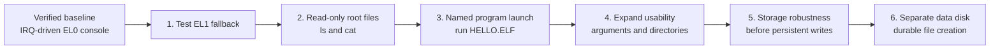
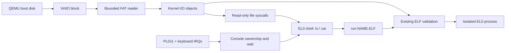

# CantayaOS Roadmap

CantayaOS is moving from a validated QEMU kernel and console toward a small,
usable EL0 environment. The first user-facing goal is a shell that can list and
read files, run a named program from the boot disk, and report its exit status.

[STATUS.md](STATUS.md) remains the source of truth for the active milestone,
verified behavior, constraints, and blockers. This document records the ordered
roadmap. Complete and verify one milestone before relaxing its corresponding
constraint in `STATUS.md`.

## Milestone Map

| Milestone | Work | Completion check | State |
| --- | --- | --- | --- |
| **1. Verify fallback** | Add a separate private smoke boot that lets the EL0 shell claim input and then deliberately exit. Check that the EL1 prompt takes over serial and keyboard input. Keep the existing probe boot and ordinary boot checks. | `make smoke` passes all three boot paths; fallback is absent from an ordinary boot. | Complete |
| **2. Expose read-only files** | Extend the bounded FAT and I/O path to enumerate and read files in the boot disk's root directory. Add typed, process-local read-only file handles and shell `ls` and `cat`. | QEMU checks command output, end-of-file, stale handles, invalid pointers and names, and directory end-of-list. | Complete |
| **3. Run named programs** | Add a named file source to process creation through the existing ELF loader. Package `HELLO.ELF` and add shell `run PATH`. | QEMU checks program output and exit status; missing and invalid executables fail before launch. | Complete |
| **4. Expand usability** | Add a bounded argument string and one level of FAT 8.3 subdirectories. | QEMU checks `ls DOCS`, `cat DOCS/NOTE.TXT`, and `run BIN/HELLO.ELF world`. | Complete |
| **5. Storage robustness** | Add malformed FAT and ELF image regressions, then define integrity and recovery requirements for persistent writes. | The targeted corrupt fixtures fail without a kernel panic or published file/process handle; a write gate is documented before implementation. | Complete |
| **6. Separate data disk and durable creation** | Discover a distinct VirtIO data disk, validate it without changing the boot ESP, then implement bounded root-file creation with a recoverable commit protocol. | Private-disk QEMU tests cover reboot persistence, injected write/flush failures, interrupted transactions, capacity limits, and recovery; the three existing boots still pass. | Complete |

## Completed Desktop Foundation

The first EL0 desktop is implemented alongside the storage roadmap. It has
software rendering through bounded kernel blits, structured keyboard/tablet
input, a background and taskbar, draggable terminal and Files windows, and
read-only text previews. All three existing smoke boot paths remain required;
ordinary boot adds screenshot-based interaction checks. See
[docs/desktop.md](docs/desktop.md) for its completed scope and limits.
Independent graphical applications now use bounded copied surfaces and routed
input, with asynchronous launch and the separately built Paint example. Window
resizing and minimizing are implemented, with terminal text reflow and Paint
drawing retention across size changes. Richer application services remain
later work. Durable storage remains milestone 6 above.

## Read And Run Data Flow

## Interfaces And Boundaries

- Preserve the `-1` console-output and `-2` console-input pseudo-handles. Use
  `NtCreateFile`, `NtReadFile`, and `NtClose` for read-only regular files in the
  root or one subdirectory; query directories for `ls`. File reads have a
  per-handle offset and return a zero byte count at end of file.
- Selector `2` of `NtCreateProcess` loads a bounded 8.3 path from the root or
  one subdirectory, with an optional argument string of at most 64 printable
  ASCII bytes. Selectors `0` and `1` retain their regression contracts. Named
  image bytes pass through I/O ownership and the existing ELF loader.
- Revise the relevant "do not implement yet" restrictions in `STATUS.md` at
  each completed milestone. Keep the process, handle, memory-isolation, and
  console-ownership guarantees throughout.

## Verification

Run `make smoke` for every kernel, syscall, shell, or disk change, and retain
the current lifecycle marker contract in CI. Add targeted checks for fallback
ownership transfer, directory end-of-list, file end-of-file, stale file
handles, and failed program launches.

The roadmap targets the existing single-core QEMU `virt` and OVMF platform.
The completed file workflow is read-only and uses 8.3 names at the root or one
subdirectory. Milestone 6 introduces a separate data disk and gates writable
storage on durability and recovery checks. Hardware portability, SMP, and
Windows application compatibility remain outside these milestones.

The persistent-write acceptance gate is in
[docs/storage-integrity.md](docs/storage-integrity.md).
