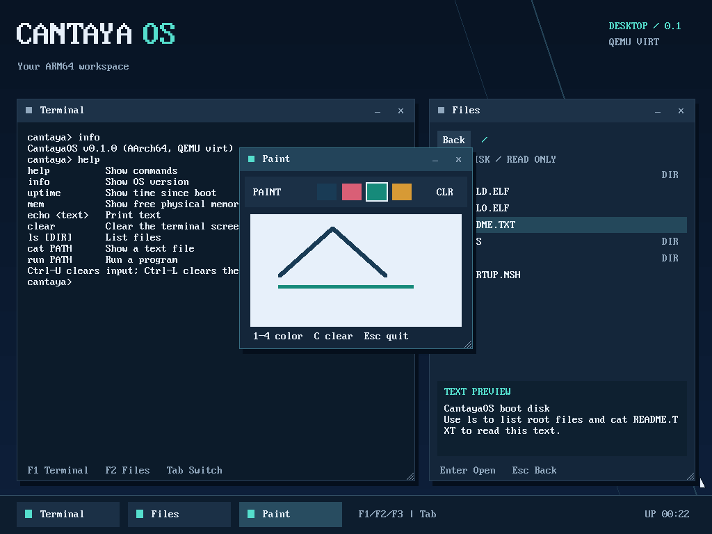

# CantayaOS
[](https://github.com/sbmfree/CantayaOS-ARM64/actions/workflows/rust.yml)

CantayaOS is an independent operating system project I am building from scratch in Rust to
learn and demonstrate how computers run software. It explores low-level
concepts such as kernels, processes, memory management, hardware interaction,
and system calls through a working system in QEMU.



CantayaOS is a Rust operating system for AArch64 (ARMv8-A) systems with UEFI
boot and an NT-like kernel architecture. Its custom PE32+ loader uses
`uefi-rs`, and its supported development platform is QEMU `aarch64` `virt`
with OVMF.

For the active milestone, constraints, and required validation, start with
[STATUS.md](STATUS.md). The longer roadmap and diagrams are in
[PLAN.md](PLAN.md). The complete documentation map is in
[docs/README.md](docs/README.md).

## Implemented Features

- Rust UEFI bootloader that loads the kernel and initial user program.
- AArch64 kernel execution at EL1 and user processes running at EL0.
- Isolated user virtual address spaces using TTBR0 and a TTBR1 kernel mapping.
- Timer-based preemptive scheduling and process and thread management.
- System calls and typed handles for process and thread objects.
- VirtIO block device access and FAT-backed loading of the fixed `CHILD.ELF` image.
- EL0 desktop with a software cursor, taskbar, movable and resizable windows, terminal,
  and read-only file browser. VirtIO keyboard and absolute pointer input work
  alongside the serial console; an EL1 prompt remains as a fallback.
- Read-only FAT file handles and one-level 8.3 directory traversal from EL0.
- Shell `ls`, `cat`, and `run` commands; named ELF programs receive a bounded
  argument string and report an exit status.
- Automated QEMU smoke testing locally and in GitHub Actions.

## Architecture At A Glance

The UEFI loader reads `kernel.elf` and `init.elf` from the ESP, exits boot
services, and hands a `BootInfo` structure to the kernel. The kernel brings up
the AArch64 MMU and exception handling, transitions to TTBR1 high-half
execution, initializes hardware and executive subsystems, then schedules EL0
processes with private TTBR0 address spaces. A fixed kernel-owned I/O path can
load the root-level FAT `CHILD.ELF` through VirtIO block I/O.

See [docs/architecture.md](docs/architecture.md) for subsystem boundaries and
memory layout. Do not infer current implementation priorities from this
overview; [STATUS.md](STATUS.md) is authoritative for those.

---

## Prerequisites

```bash
# macOS (Apple Silicon)
brew install qemu mtools

# Rust nightly (selected by rust-toolchain.toml)
rustup toolchain install nightly
rustup component add rust-src llvm-tools-preview --toolchain nightly
```

### OVMF Firmware

`make build`, `make run`, and `make smoke` require AArch64 OVMF firmware at
`tools/OVMF_CODE.fd` and writable variables at `tools/edk2-arm-vars.fd`.

```bash
mkdir -p tools

# Requires rpm2cpio: brew install rpm2cpio
curl -L \
  "https://dl.fedoraproject.org/pub/fedora/linux/releases/40/Everything/aarch64/os/Packages/e/edk2-aarch64-20240524-3.fc40.noarch.rpm" \
  -o /tmp/edk2.rpm

cd /tmp && rpm2cpio edk2.rpm | cpio -idmv
cp /tmp/usr/share/edk2/aarch64/QEMU_EFI.fd /path/to/CantayaOS-ARM64/tools/OVMF_CODE.fd
cp /tmp/usr/share/edk2/aarch64/QEMU_VARS.fd /path/to/CantayaOS-ARM64/tools/edk2-arm-vars.fd
```

---

## Build And Run

```bash
# Build the UEFI loader, kernel, and three user-mode ELFs.
make build

# Build the initial, CHILD.ELF, and HELLO.ELF user-mode programs.
make user

# Create the FAT32 ESP image with boot artifacts, sample files, and programs.
make iso

# Build the image and launch QEMU with a visible display.
make run

# Build and boot QEMU headlessly, validating smoke, ordinary, and fallback boots.
make smoke

# Remove generated build artifacts and disk images.
make clean
```

After both boot validation programs finish, the initial user process starts
an EL0 desktop with Terminal and Files windows. The bootloader selects a
1024x768 display mode when available. The desktop draws into private user
buffers and presents bounded updates through the kernel; it uses software
rendering and QEMU's VirtIO keyboard and absolute tablet pointer.

Click a window or its taskbar button to focus it. Drag a title bar to move a
window; drag the bottom-right grip to resize it. Click `_` to minimize and
restore with the taskbar or focus shortcuts. Terminal reflows its text; Paint
keeps strokes hidden by a smaller canvas. Terminal and Files can also be hidden
with `x` and reopened from the taskbar.
F1 opens Terminal, F2 opens Files, F3 launches or focuses Paint, and Tab cycles
through windows. In Files, click a folder, `.TXT` file or `.ELF` app, or use
Up/Down and Enter. Back or Esc returns to the
root. The preview shows up to four wrapped lines from the first 1 KiB of a
text file; use terminal `cat` for the complete text.

The terminal accepts `help`, `info`, `uptime`, `mem`, `echo <text>`, `clear`,
`ls [DIR]`, `cat PATH`, and `run PATH [argument]`. Try `cat README.TXT`,
`ls DOCS`, or `run BIN/HELLO.ELF world`. Files are read-only and names use
FAT 8.3 format in the root or one subdirectory. Backspace edits the line,
Ctrl-U clears it, and Ctrl-L clears the terminal while retaining the command.
Commands and program output also appear on the serial console that launched
`make run`; serial input always addresses the terminal. The desktop blocks
when no input, output or application update is ready. Graphical `run` launches
asynchronously and reports completion while the desktop stays responsive.
Paint runs in a separate EL0 process: click and drag to draw, use keys 1–4 for
colors, C to clear, and Esc to quit. App `x` closes its surface; restarting Paint
creates a blank canvas. The boot disk remains read-only. A separate `CANTDATA`
disk is used only by private transaction regression probes; no shell write
command exists.

The graphical desktop supports 800x600 through 1024x768 RGB/BGR framebuffers.
Other display configurations retain the text shell. If the user process
exits, the EL1 terminal reclaims the display and both console input devices.
See [docs/desktop.md](docs/desktop.md) for the graphics ABI and current limits.

`make smoke` is the current regression check. Its scope and expected runtime
evidence are documented in [docs/verified-features.md](docs/verified-features.md).
It runs the input-ownership probe only on a private copy of the boot disk, then
checks the unmodified disk's interactive keyboard and serial input. A third
private boot deliberately ends the active desktop and verifies EL1 fallback input.
The ordinary boot also checks actual framebuffer pixels for mouse movement,
focus, file previews, dragging, closing and reopening windows, and independent
Paint applications with asynchronous launch and completion. It also verifies
resizing, text reflow, drawing retention and minimize/restore. It saves a
screenshot to `target/desktop.ppm`.
The Rust GitHub Actions workflow also runs this headless QEMU check on Ubuntu
with AArch64 UEFI firmware.

---

## Project Structure

```
CantayaOS-ARM64/
├── bootloader/    UEFI PE32+ loader and handoff
├── kernel/        AArch64 kernel, HAL, drivers, executive, and syscalls
├── shared/        no_std handoff, desktop ABI, and bitmap font
├── user/          Initial EL0 validation, desktop, and shell executable
├── user-child/    Dedicated FAT-backed CHILD.ELF executable
├── user-paint/    Independent EL0 Paint graphical application
├── user-hello/    Named HELLO.ELF demo executable
├── scripts/       QEMU smoke-test driver
├── docs/          Architecture and verified-feature reference
├── PLAN.md        Ordered roadmap and target data flow
├── STATUS.md      Current milestone and implementation constraints
└── Makefile       Build, image, QEMU, and smoke-test targets
```

## Current Work

[STATUS.md](STATUS.md) is the current source of truth for the active milestone,
constraints, blockers, and verification requirements. [PLAN.md](PLAN.md)
records the ordered roadmap. For completed guarantees,
search [docs/verified-features.md](docs/verified-features.md); for stable
subsystem design, read [docs/architecture.md](docs/architecture.md).

---

## Licensing

CantayaOS is **source available, not open source**. You may inspect and study
the source, and the [CantayaOS Source Available License](LICENSE) permits
private non-commercial personal and educational use. Commercial use,
redistribution, resale, sublicensing, and distribution of modified or
closed-source derivatives require prior, explicit written permission from
Oliwier Wieczorek. Commercial licensing is available only through that written
permission.

Copyright © 2026 Oliwier Wieczorek. All rights reserved. Earlier versions
released under the MIT License retain their original license; this license
applies to versions first published with it. Third-party materials and
dependencies retain their own licenses.
