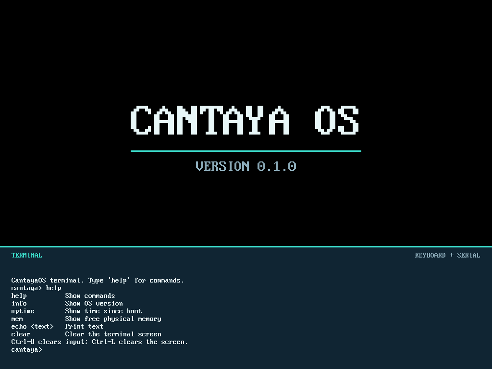

# CantayaOS
[](https://github.com/sbmfree/CantayaOS-ARM64/actions/workflows/rust.yml)

CantayaOS is an independent operating system project I am building from scratch in Rust to
learn and demonstrate how computers run software. It explores low-level
concepts such as kernels, processes, memory management, hardware interaction,
and system calls through a working system in QEMU.



CantayaOS is a Rust operating system for AArch64 (ARMv8-A) systems with UEFI
boot and an NT-like kernel architecture. Its custom PE32+ loader uses
`uefi-rs`, and its supported development platform is QEMU `aarch64` `virt`
with OVMF.

For the active roadmap, constraints, and required validation, start with
[STATUS.md](STATUS.md). The complete documentation map is in
[docs/README.md](docs/README.md).

## Implemented Features

- Rust UEFI bootloader that loads the kernel and initial user program.
- AArch64 kernel execution at EL1 and user processes running at EL0.
- Isolated user virtual address spaces using TTBR0 and a TTBR1 kernel mapping.
- Timer-based preemptive scheduling and process and thread management.
- System calls and typed handles for process and thread objects.
- VirtIO block device access and FAT-backed loading of the fixed `CHILD.ELF` image.
- Built-in terminal input through serial and VirtIO keyboard, with framebuffer output.
- Automated QEMU smoke testing locally and in GitHub Actions.

## Architecture At A Glance

The UEFI loader reads `kernel.elf` and `init.elf` from the ESP, exits boot
services, and hands a `BootInfo` structure to the kernel. The kernel brings up
the AArch64 MMU and exception handling, transitions to TTBR1 high-half
execution, initializes hardware and executive subsystems, then schedules EL0
processes with private TTBR0 address spaces. A fixed kernel-owned I/O path can
load the root-level FAT `CHILD.ELF` through VirtIO block I/O.

See [docs/architecture.md](docs/architecture.md) for subsystem boundaries and
memory layout. Do not infer current implementation priorities from this
overview; [STATUS.md](STATUS.md) is authoritative for those.

---

## Prerequisites

```bash
# macOS (Apple Silicon)
brew install qemu mtools

# Rust nightly (selected by rust-toolchain.toml)
rustup toolchain install nightly
rustup component add rust-src llvm-tools-preview --toolchain nightly
```

### OVMF Firmware

`make build`, `make run`, and `make smoke` require AArch64 OVMF firmware at
`tools/OVMF_CODE.fd` and writable variables at `tools/edk2-arm-vars.fd`.

```bash
mkdir -p tools

# Requires rpm2cpio: brew install rpm2cpio
curl -L \
  "https://dl.fedoraproject.org/pub/fedora/linux/releases/40/Everything/aarch64/os/Packages/e/edk2-aarch64-20240524-3.fc40.noarch.rpm" \
  -o /tmp/edk2.rpm

cd /tmp && rpm2cpio edk2.rpm | cpio -idmv
cp /tmp/usr/share/edk2/aarch64/QEMU_EFI.fd /path/to/CantayaOS-ARM64/tools/OVMF_CODE.fd
cp /tmp/usr/share/edk2/aarch64/QEMU_VARS.fd /path/to/CantayaOS-ARM64/tools/edk2-arm-vars.fd
```

---

## Build And Run

```bash
# Build the UEFI loader, kernel, and both user-mode ELFs.
make build

# Build only the initial and CHILD.ELF user-mode programs.
make user

# Create the FAT32 ESP image containing the boot artifacts and CHILD.ELF.
make iso

# Build the image and launch QEMU with a visible display.
make run

# Build and boot QEMU headlessly, validating the runtime smoke contract.
make smoke

# Remove generated build artifacts and disk images.
make clean
```

After both boot validation programs finish, the QEMU window clears the boot
logs and shows a CantayaOS banner, version, and terminal pane at the bottom.
The bootloader selects a 1024x768 display mode when the firmware offers it.
Click the QEMU window to type into the terminal using its VirtIO keyboard;
the serial console in the shell that launched `make run` (`-serial stdio`)
also accepts input. Commands and their output appear in both places. Type
`help` for the built-in commands: `help`, `info`, `uptime`, `mem`,
`echo <text>`, and `clear`. Backspace edits the line; Ctrl-U clears it, and Ctrl-L
redraws the terminal screen. The current keyboard map covers US ASCII keys,
Shift, Caps Lock, and these editing keys; input is polled by the kernel shell.
The prompt accepts built-in commands, not arbitrary programs or file paths.

`make smoke` is the current regression check. Its scope and expected runtime
evidence are documented in [docs/verified-features.md](docs/verified-features.md).
The Rust GitHub Actions workflow also runs this headless QEMU check on Ubuntu;
CI installs AArch64 UEFI firmware and uses a longer timeout for emulation.

---

## Project Structure

```
CantayaOS-ARM64/
├── bootloader/    UEFI PE32+ loader and handoff
├── kernel/        AArch64 kernel, HAL, drivers, executive, and syscalls
├── shared/        no_std bootloader/kernel handoff types
├── user/          Initial EL0 user executable
├── user-child/    Dedicated FAT-backed CHILD.ELF executable
├── scripts/       QEMU smoke-test driver
├── docs/          Architecture and verified-feature reference
├── STATUS.md      Current roadmap and implementation constraints
└── Makefile       Build, image, QEMU, and smoke-test targets
```

## Current Work

[STATUS.md](STATUS.md) is the current source of truth for priorities,
constraints, blockers, and verification requirements. For completed guarantees,
search [docs/verified-features.md](docs/verified-features.md); for stable
subsystem design, read [docs/architecture.md](docs/architecture.md).

---

## Licensing

CantayaOS is **source available, not open source**. You may inspect and study
the source, and the [CantayaOS Source Available License](LICENSE) permits
private non-commercial personal and educational use. Commercial use,
redistribution, resale, sublicensing, and distribution of modified or
closed-source derivatives require prior, explicit written permission from
Oliwier Wieczorek. Commercial licensing is available only through that written
permission.

Copyright © 2026 Oliwier Wieczorek. All rights reserved. Earlier versions
released under the MIT License retain their original license; this license
applies to versions first published with it. Third-party materials and
dependencies retain their own licenses.
