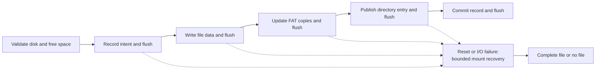

# Persistent Storage Integrity Gate

CantayaOS mounts its FAT32 boot disk read-only. A separate private `CANTDATA`
disk now implements this bounded transactional create contract. The current
kernel and shell still expose no public write path.

## First Writable Scope

- Use a separate QEMU VirtIO data disk. Keep the UEFI boot disk and its
  `CHILD.ELF`, `HELLO.ELF`, and documentation files read-only.
- Start with creating a new root-level 8.3 regular file. Serialize one writer
  at a time. Defer overwrite, append, rename, delete, subdirectory mutation,
  concurrent writers, and removable media.
- Cap file size, cluster count, path length, and the time spent traversing FAT
  chains. Validate the full destination geometry and FAT copies before a write.
- Require explicit cache flush support from the block device. A completed
  syscall must mean its committed file survives a guest reset, not merely that
  QEMU accepted writes into a cache.

## Integrity Requirements

| Invariant | Required behavior |
| --- | --- |
| Boot isolation | Failure on the data disk cannot change or prevent boot from the read-only ESP. |
| No partial publication | A failed create leaves no directory entry or user handle for the new file. A reader sees either the complete file or no file. |
| FAT consistency | Every published file has a valid, acyclic cluster chain of the declared length. Both FAT copies agree on committed allocations. |
| Bounded recovery | An interrupted operation is detected on the next mount and either completed or rolled back within a fixed scan bound. Unreachable allocated clusters are reclaimed or reported before new writes. |
| Honest completion | A completed internal create, and any future `STATUS_SUCCESS`, occurs only after data and metadata are durable. Device, capacity, and validation errors return a failure status without publishing an object. |
| Handle isolation | Failed or interrupted writes cannot make stale process-local handles valid or expose another process's data. |

FAT32 metadata spans multiple sectors, so write ordering alone is insufficient
for this contract. The implementation needs a small transaction record or an
equivalent copy-on-write commit protocol on the data disk. The record must
identify the intended directory entry, allocated cluster chain, operation
phase, and checksum. Flush data and transaction state before publishing the
directory entry; flush the commit state before returning success. Recovery
must tolerate a torn or missing record and must never trust its offsets without
checking volume bounds. The exact on-disk record format is an implementation
decision for that milestone.

One candidate transaction sequence is:

## Required QEMU Regressions

1. Create and read back a file, reboot the guest, and read the same bytes.
2. Inject block-write and flush failures at every phase. Check that no handle
   or partial file is published and that a later good create still succeeds.
3. Stop QEMU at each transaction phase, reboot from the same private data-disk
   copy, and check recovery plus FAT-copy agreement.
4. Fill the volume and exhaust directory slots. Check bounded failure with no
   leaked clusters or changed existing files.
5. Corrupt a FAT link, directory entry, transaction record, and data sector in
   separate private copies. Check bounded mount/recovery failure and preserved
   boot-disk access.
6. Keep the existing three-boot read-only `make smoke` contract as a gate for
   every kernel or disk change.

## Verification Outcome (2026-10-07)

`make smoke` passes all required private data-disk checks: persistence across a
reboot, injected write and flush failures, process-killed interruption at each
of the eight durable transaction checkpoints, capacity and root-directory
exhaustion, and FAT/directory/journal/payload corruption rejection. The normal
read-only desktop, private smoke, and fallback boots continue to pass. These
checks exercise only the internal protocol; no syscall or shell write command
is enabled.
